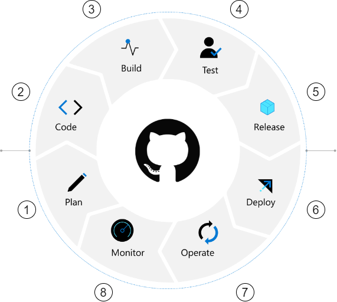
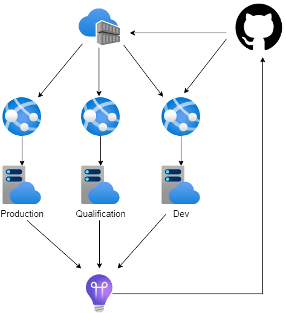

# What The Hack - DevOps with GitHub

## Introduction
DevOps is a journey not a destination. Our goal when writing this challenged based hack is to introduce you to GitHub and some common DevOps practices. We also understand that your choice of programming language and DevOps processes might differ from the ones we will be using in this hack, that is OK. Our intent was to select some of the most common programming languages and highlight industry best practices, with an emphasis on showing how GitHub can help you on your DevOps journey, so that you can apply this in your environment with the languages and tools that you use.

## Learning Objectives

This DevOps with GitHub hack will help you learn:

1. How to use GitHub to manage source control
1. How to use GitHub for Project Management
1. How to use GitHub Actions for CI & CD
1. Monitoring apps with Application Insights

## Challenges

 - [Challenge 0](./Student/challenge00.md) - Setup and Introduction
 - [Challenge 1](./Student/challenge01.md) - Track your work with GitHub Project Boards
 - [Challenge 2](./Student/challenge02.md) - Centralize your code with GitHub Repos
 - [Challenge 3](./Student/challenge03.md) - Infrastructure as Code
 - [Challenge 4](./Student/challenge04.md) - Continuous Integration
 - [Challenge 5](./Student/challenge05.md) - Build and push Docker image to container registry
 - [Challenge 6](./Student/challenge06.md) - Continuous Delivery
 - [Challenge 7](./Student/challenge07.md) - Branching & Policies
 - [Challenge 8](./Student/challenge08.md) - Monitoring: Application Insights
 - [Challenge 9](./Student/challenge09.md) - Security

## Target Architecture

## Prerequisites
- Your own Azure subscription with **owner** access. See considerations below for additional guidance.
- [Visual Studio Code](https://code.visualstudio.com)
- [Git SCM](https://git-scm.com/download)

## Repository Contents
- `../Student`
  - Student Challenge Guides
- `../Student/Resources`
  - Student's resource files, code, and templates to aid with challenges

## Considerations

If you are running this hack with a group, here are some options for providing access to Azure:
- Each person/team uses their own subscription (ideal)
- Use a single subscription with each person/team using a different resource group
- Use a single subscription and resource group, with each person/team creating resources within the single resource group (less ideal)

Regardless of the option you choose, you'll have to consider:
- [Azure default quotas and resource limits](https://docs.microsoft.com/en-us/azure/azure-resource-manager/management/azure-subscription-service-limits) (for example, # of VMs allowed per region or subscription)
- Unique naming of resources - many services may require a globally unique name, for example, App service, container registry.

## Contributors
- Kevin M. Gates
- Will Fox
- Andy Huang
- Julia Nathan
